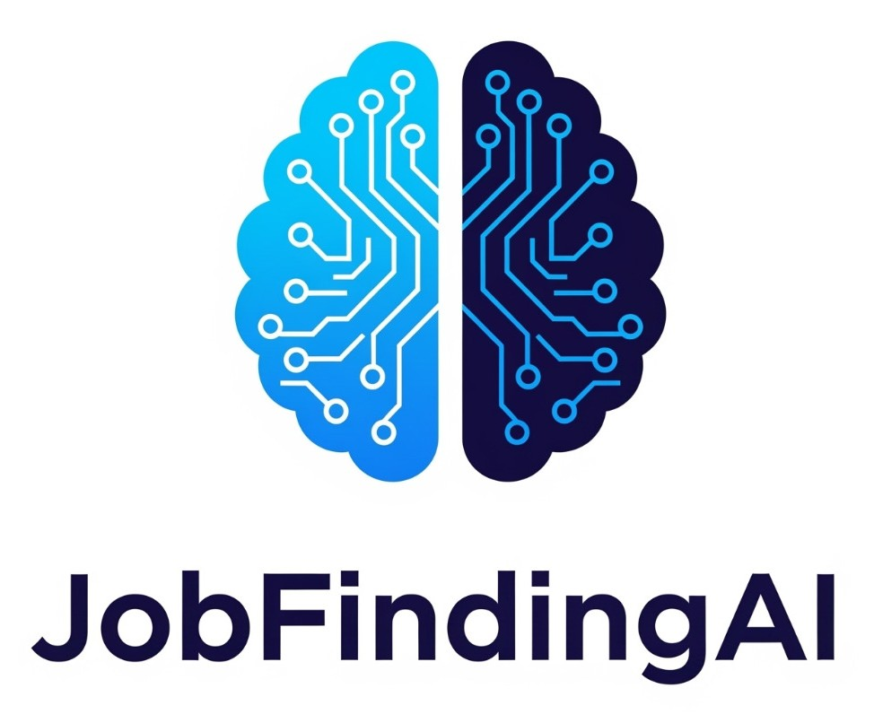

# 💼 JobFindingAI

<<<<<<< HEAD

An AI-powered job search and application automation tool that helps candidates discover and apply for relevant job opportunities effortlessly.
=======
**JobFindingAI** is an AI-powered job search and application automation platform that helps candidates **discover**, **optimize**, and **apply** for the most relevant job opportunities — all in one place.

>>>>>>> 7a022f0585164625d516a8f94331b42d826b9459

---

## 🚀 Features

- 🔍 **AI-Based Job Matching**  
  Get personalized job recommendations powered by advanced AI algorithms.

- 📝 **Resume Analysis & Optimization**  
  Let the AI scan your resume and suggest improvements to stand out from the crowd.

- 📬 **Automated Job Applications**  
  Apply to multiple job listings automatically with tailored resumes and cover letters.

- 📊 **Application Tracking Dashboard**  
  Track your job applications, status updates, and success rates in a single unified dashboard.

- 🔔 **Real-Time Job Alerts**  
  Get notified instantly when new job opportunities matching your profile are available.

---

## 🧠 Tech Stack

- **Frontend:** Next.js (TypeScript), Tailwind CSS  
- **Backend:** Next.js API routes, MongoDB, Prisma  
- **AI Engine:** OpenAI / Custom NLP models  
- **Hosting:** Vercel  
- **Database:** MongoDB Atlas  

---
